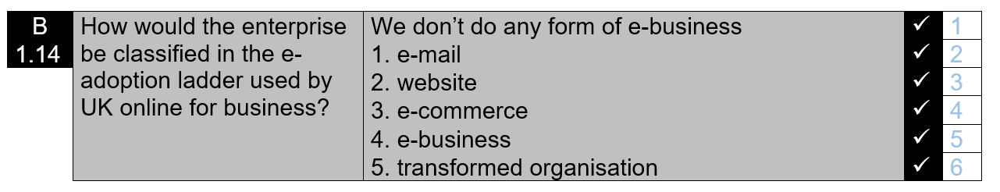

# BU2010-Visualisation
 
## Introduction

### Overview

This week you get to try out data visualisation. 

## Advice

Once you are done be sure to commit your changes again (to save them to the repository) and to push them to GitHub (so that I can see the work you have done).

It's best if you **Commit early, commit often** - that way you can go back if you have made a mistake and I can see all the work you have done. It doesn't matter if your early commits contain mistakes.  

Once you are done be sure to commit your changes (that will save them to the repository) and to push them to GitHub (so that I can see the work you have done).

## Task Explanation

Below is today's task. We will be working with a range of skills you learned in recent weeks. 

For this task, you need to provide the answers in the _visualisation.R_ file you will find in this repository, not in the Markdown file you are currently reading. 

## Your Task

Your tasks can be found in the R script file _visualisation.R_ that is part of this repository. You have to work on these tasks by yourself. Do not work with others. 

Please work on these tasks in RStudio - not on the GitHub website. If you work in RStudio you can make sure your code works as it should. If you don't work in RStudio, but edit the file on the GitHub web interface you will have to copy and paste the code into R for testing - an unnecessary step that can introduce mistakes. 

Pay attention to the autocomplete options RStudio is offering you and use them to explore how R commands work. Also, remember how useful the cursor keys and the Tab key can be. 
Pressing F1 will bring up the documentation for the selected command in the Help tab. 

Please don't forget to commit and to push your commit. 

You will find the following tasks in _visualisation.R_. In that file please write your code below the comment with the task. I have started some of the lines with the code for the answers for you. 

#### Task 1 

Set the correct Working Directory.

#### Task 2

Load the packages you need.

#### Task 3

Read the spreadsheet that comes with the repo. It contains the data you will work with. 

#### Task 4

The spreadsheet contains two columns I want you to work with: _computers_ and _ladder_. 
Each row represents a company. 
The computer column represents how many computers these companies have in their business.
The ladder column represents where the companies are on the e-adoption ladder. The picture below shows how it is coded. The blue numbers show how responses are recorded in the spreadsheet. 

Visualise the data in a meaningful way and label it nicely. Make sure the person looking at the visualisation can get an impression how the data is distributed. You don't have to show outliers if they make it difficult to understand the plot. 

#### Task 5

Save the image for use in a publication. It will be printed with a width of 18cm in a publication that is printed with 300 dpi. Choose suitable values when saving the image. 

